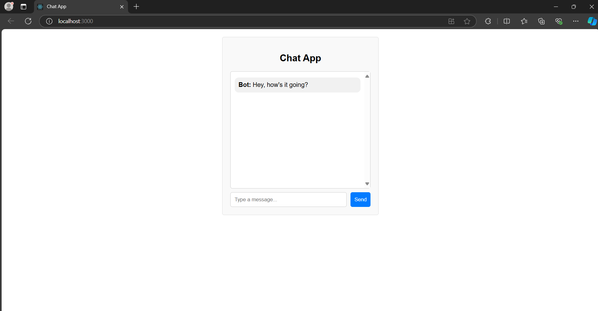
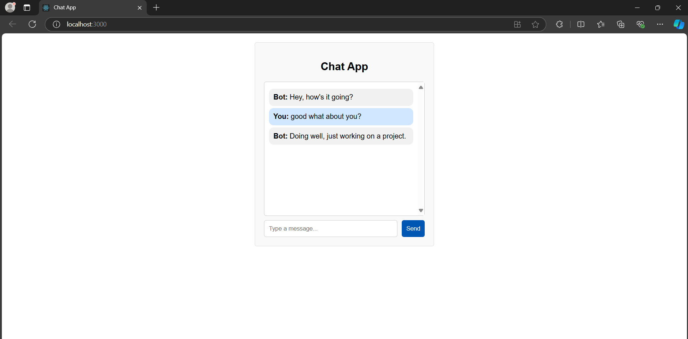

## Chat-App
A simple React-based chat application that alternates between predefined static messages and dynamic user input messages.
## Features
- Displays the first static message.
- Alternates between dynamic user input and predefined static messages.
- Displays static messages sequentially after each dynamic message is sent.
- Simple and responsive UI for sending messages.
## Technologies Used
  - React.js: Frontend JavaScript library for building user interfaces.
  - CSS: For styling the app.
  - JavaScript (ES6): Used to handle the quiz logic and state management. 
  - HTML5: Basic structure of the web pages.
## Screenshots
<div align="center">
     &nbsp;&nbsp; 
     
</div>

## Installation
### Clone the Project
``` bash
git clone https://github.com/sharlinaik/Chat-App.git
cd Chat-App
```


